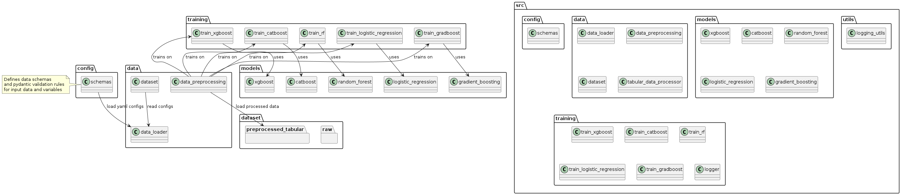
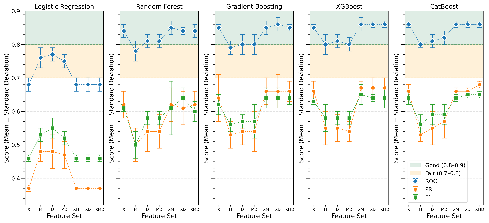
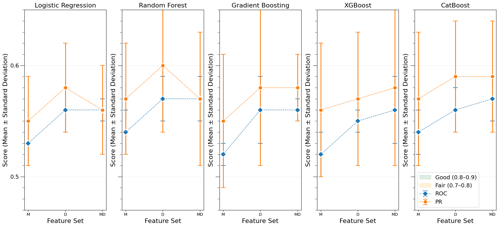
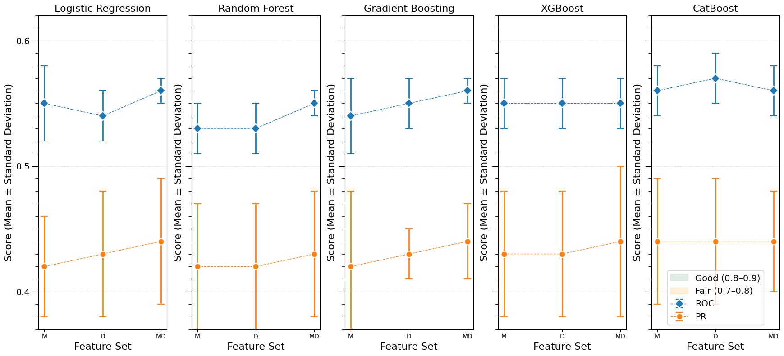
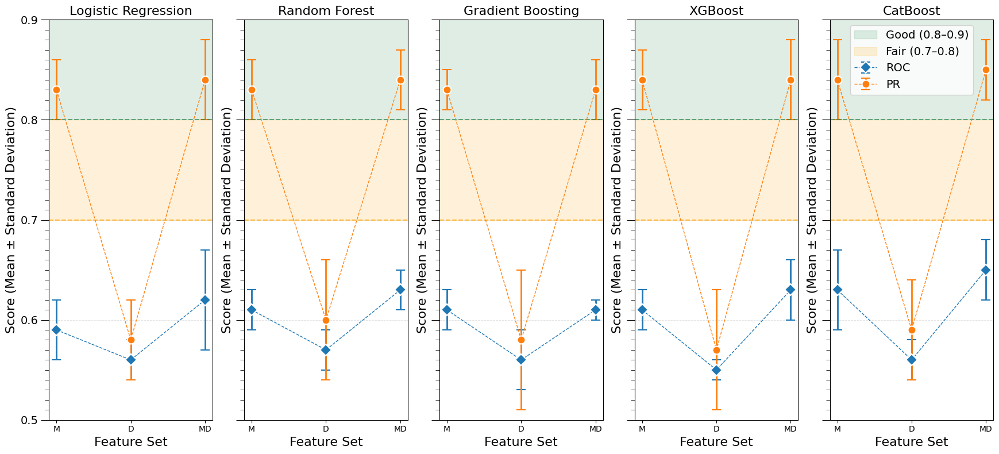
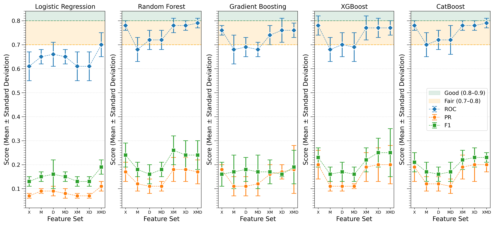
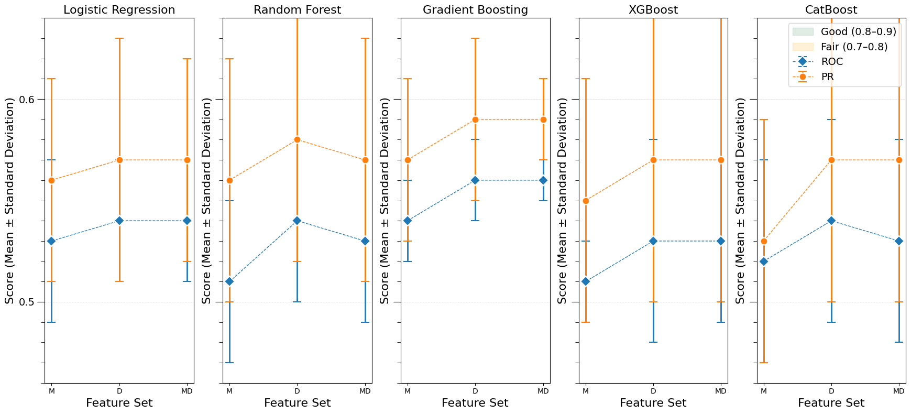
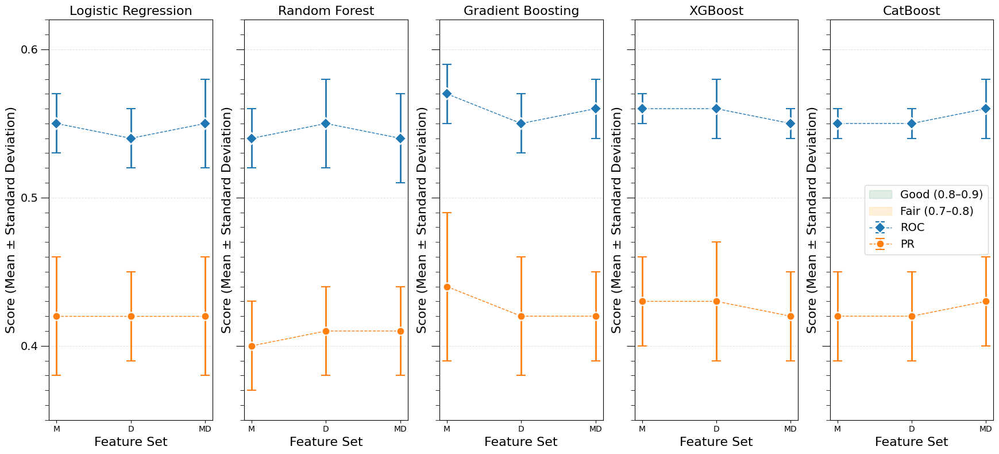
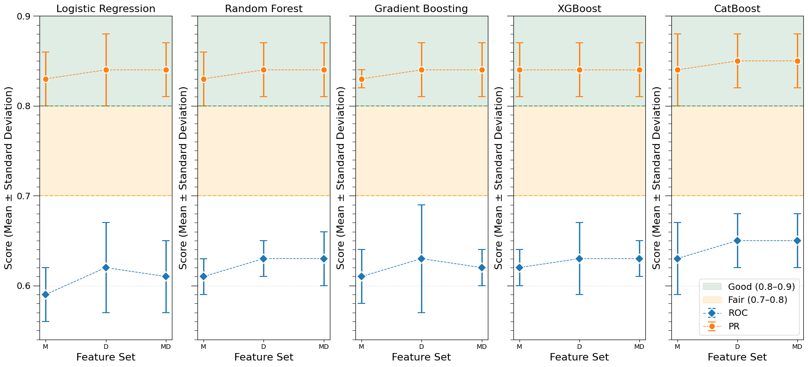

# Informative Missingness

### 📁 Project Structure
```bash
project/
├── configs/
│   └── config.yml                # Configuration for all the Machine Learning models
├── dataset/                      # Data loading & preprocessing
│   ├── preprocessed_tabular/     # Stores preprocessed tabular data
│   ├── raw/                      # Stores raw data before preprocessing
│   └── temp/                     # Stores intermediate data (from PostgreSQL)
├── db_utils/                     # Configurations for the PostgreSQL database
│   └── db_config.py              # Stores DB configurations 
│   └── db_setup.py               # Used to connect to the DB display infos
├── notebooks/                    
│   └── exp_2025.ipynb                          # Jupyter notebooks for exploration and debugging
│   └── plot_metric_results.ipynb                # Plotting metric results
├── outputs/                      # output for all the experiments
│   └── experiments
│   │   ├── 20250811_222344         # This folder is created based on the date and time
│   │   │   └── logs/               # Stores logs for different ML models
│   │   │   └── models/             # logs models training parameters  
│   │   │   └── results/            # stores models results
├── plots/                          # Stores performance plots and visualizations
├── scripts/                        # Scripts to prepare raw data by querying PostgreSQL
│   └── fetch_demographics_data.py      # fetches the demographics data from DB and merge the target file
│   └── fetch_labevents_data.py         # fetches the labevents data from DB
│   └── prepare_data.py                 # main entry point to the raw data extraction process pipeline
├── src/
│   ├── config/
│   │   └── schemas.py            # Pydantic validation for all the classes, methods, and data types
│   ├── data/                     # Data handling and preprocessing
│   │   ├── data_loader.py        # Loads data from sources
│   │   ├── dataset.py            # Dataset logic and split handling
│   │   ├── data_preprocessing.py               # Data preprocessing methods definition
│   │   ├── tabular_data_preprocessor.py        # Tabular data preprocessing
│   │   └── temporal_preprocessing.py           # Temporal feature engineering
│   ├── models/
│   │   └── random_forest.py        # Random Forest model definition
│   │   └── gradient_boosting.py    # Gradient Boosting model definition
│   │   └── XGBoost.py              # XGBoost model definition
│   │   └── CatBoost.py             # CatBoost model definition
│   ├── training/
│   │   └── train_rf.py             # Training logic for Random Forest
│   │   └── train_gradboost.py      # Training logic for Gradient Boosting
│   │   └── XGBoost.py              # Training logic for XGBoost
│   │   └── CatBoost.py             # Training logic for CatBoost
│   └── utils/
│       └── logging_utils.py        # Logging configuration and setup
├── train_models.sbatch             # Slurm script to assign model training process in HPC
├── run_exp.py                      # this script is only used while training models without docker
├── train_model.py                  # this script is used while training models in docker container
docker/
├── Dockerfile                      # All the necessary configurations during container creation
docker-compose.yml                  # Docker container build related configuration
```
---
## Codebase at a glance


---
## Docker configuration
All the configurations related to docker can be found inside `docker-compose.yml` file. Configurations related to memory might need to be adjusted as per your system.
```bash
resources:
    limits:
        cpus: '12'
        memory: 4G
    reservations:
        memory: 4G
```
- Rest of the configurations should be fine. You can find the postgres login details under `environment` variable:
---

## Loading the data to `postgres` docker container
- Copy `postgres/load.sql` to `load_mimic.sql`
    - `docker cp postgres/load.sql mimiciv_postgres:load_mimic.sql`
- Then docker execute the `load_mimic.sql`
    - `docker exec -it mimiciv_postgres psql -U postgres -d mimiciv -f /load_mimic.sql`
- This will take sometime. You can then test it with the following query to login to postgres and display the data, for example, from the `mimiciv_hosp.admissions` table.
    - `docker exec mimiciv_postgres psql -U postgres -d mimiciv -c "SELECT * FROM mimiciv_hosp.admissions;"`
---

## Data Extraction
- Cohort data must be extracted first from the `PostgreSQL` database.
- Make sure `postgres` container is running by doing `docker compose up -d`. This will start all the containers basically.

### Raw data extraction process pipeline
- Before running the pipeline, it's important to have your data ready. For **extracting and preparing the raw data**, the `scripts/prepare_data.py` need to be executed. Refer to [scripts/README.md](project/scripts/README.md) for more instructions.

---

## Configurations

Before starting model training, you **must review and adjust the configuration files** inside the [`configs/`](configs/) directory.  

👉 See the [configs/README.md](project/configs/README.md) for detailed instructions on how to set:  
- Cohort-specific training data  
- Window sizes (7, 14, or 21 days, matching raw data preparation)  
- Feature combinations (`x`, `m`, `delta`, or their combinations)  
- Model type and hyperparameters  

⚠️ Incorrect configuration will result in invalid or inconsistent experiments.

---

## Running the pipeline locally
- Every time a *new package* is added or a change is made to the project, it is necessary to re-build the image. This will create a `model-training` container including all the packages. 
1. Using docker
```bash
docker compose build --no-cache             # builds the image
```
- Once the container is started, one or more models can be trained on independent containers separated by spaces.  
```bash
docker compose up randomforest                      # starts randomforest-trainer container 
docker compose up randomforest xgboost catboost     # starts randomforest-trainer xgboost-trainer and catboost-trainer container independently
```

2. Without using docker

```bash 
cd project
python run_exp.py
```

### Running the pipeline in `HPC` server

1. Using `apptainer/docker`
- Exclude unnecessary files before building to avoid bloating the Docker image. Make sure you have `.dockerignore` ([more info here](https://docs.docker.com/build/concepts/context/#dockerignore-files)) file at the project root. At minimum, exclude these:
```bash
# Large dataset
mimiciv/
dataset/
postgres_data/
postgres/

# Logs and temp files
*.log
tmp/

# Experiment outputs
outputs/

```

- Create wheels (`.whl`) files to avoid package dependency conflicts. These wheels are built using custom [docker/Dockerfile](docker/Dockerfile), which:
    - Ensures consistent builds by installing dependencies only from pre-downloaded  files which is super useful especially in HPC environment.
    - *Avoids PyPI network calls on HPC clusters.*
- Check out [docker/README.md](docker/README.md) for detailed instructions. 

```bash
pip download -r requirements.txt -d wheels/
```

- Build the container (`.tar`) file. This step uses the `docker/Dockerfile` to:
    - Install the system libraries required by the ML packages.
    - Copy the `wheels/` directory and install dependencies locally.
    - Package everything into a minimal, secure image for portability.
```bash
docker compose build --no-cache 
```

- Copy the `.tar` file to HPC
```bash
scp model-training.tar USERNAME@CLUSTER:/home/USERNAME/project_folder/model-training.tar  
```

- Creating `.sif` file
```bash
apptainer build model-training.sif docker-archive://model-training.tar          # create .sif file 
```

- Edit configurations in `train_models.sbatch` 
Uncomment these:
```bash
models=("RandomForest" "GradientBoosting" "LogisticRegression" "XGBoost" "CatBoost")
MODEL=${models[$SLURM_ARRAY_TASK_ID]}

apptainer exec --nv -B $PWD:/project model-training.sif \
    python project/train_model.py --model $MODEL
```

- Set the number of jobs
**Important:** Based on the number of models you are training, set the value of `#SBATCH --array` between `0-4`
```bash
#SBATCH --array=0-4    --> this will run all 5 models 

```

- Run the slurm job
```bash
sbatch -p work train_models.sbatch
```


2. Without using `apptainer/docker`
Uncomment the line:
```bash
python project/run_exp.py
```
and comment out these lines:
```bash
models=("RandomForest" "GradientBoosting" "LogisticRegression" "XGBoost" "CatBoost")
MODEL=${models[$SLURM_ARRAY_TASK_ID]}

apptainer exec --nv -B $PWD:/project model-training.sif \
    python project/train_model.py --model $MODEL
```

---

### Helpful commands 
- Copying raw data files from local to remote
```bash
scp -r raw/apl_*.parquet USERNAME@CLUSTER:/home/USERNAME/
```

--- 
## Results
- [x] Aplasia Cohort
- Clinical Target


- Gender


- Race


- Age


- [x] Neutropenic Fever Cohort
- Clinical Target


- Gender


- Race


- Age

