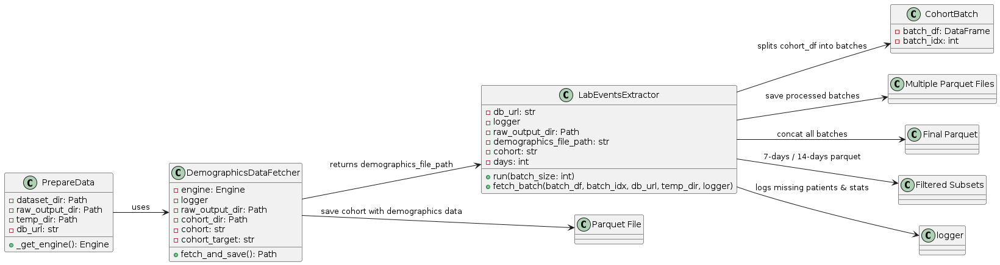

## Raw data extraction process pipeline
- `fetch_demographics_data.py` fetches only the demographics data
- `fetch_labevents_data.py` fetches the clinical records of patient
- The workflow of the modules is in the image below:




- For extracting and preparing the raw data, the `scripts/prepare_data.py` need to be executed. The script format is:
```shell
python scripts/prepare_data.py --cohort <cohort type (apl or nf)> --days <days (7 or 14)> --cohort_target <cohort_name>

# Example:
python scripts/prepare_data.py --cohort apl --days 14 --cohort_target "mimic_iv_target_apl_tr_14_days.csv.gz"
```
- The `cohort_name` is the name of the file in the `MIMIC-IV-data/` folder. In our case:
    - `mimic_iv_target_apl_tr_14_days.csv.gz`
    - `mimic_iv_target_nf_14_days.csv.gz`

- This will create a `apl_lab_events_data_with_demographics.parquet` in `raw/apl_lab_events_data_with_demographics.parquet` which will be used during preprocessing.